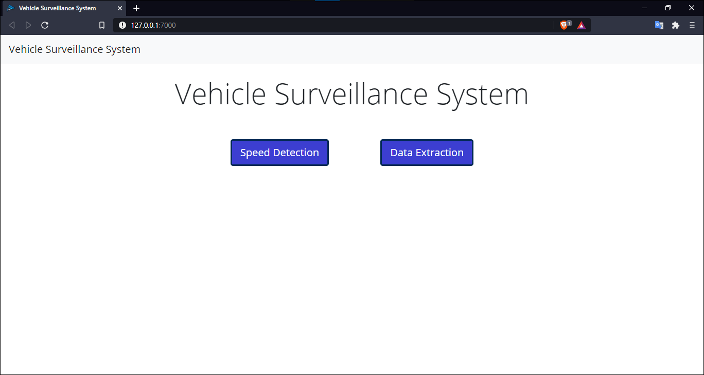
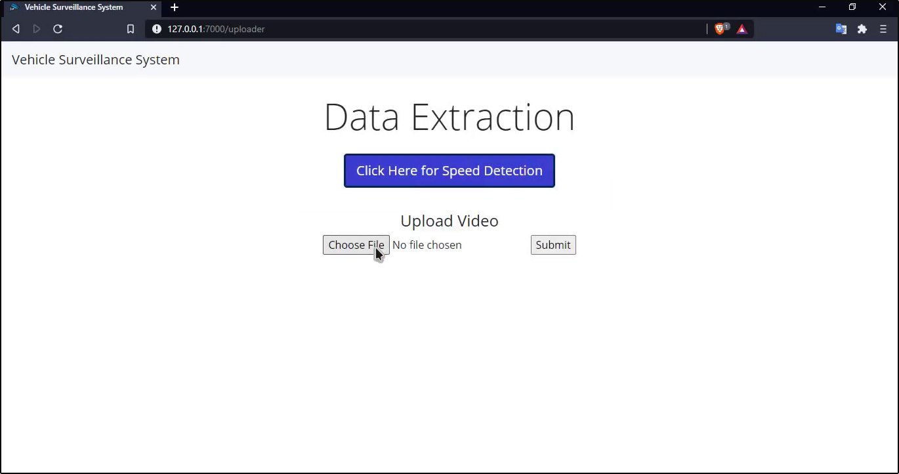
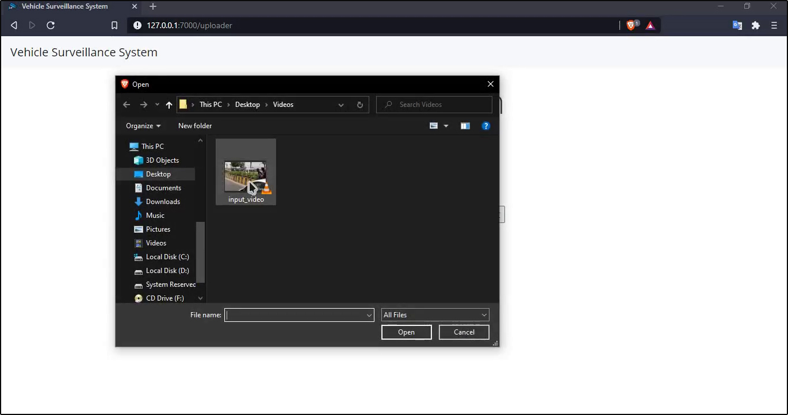
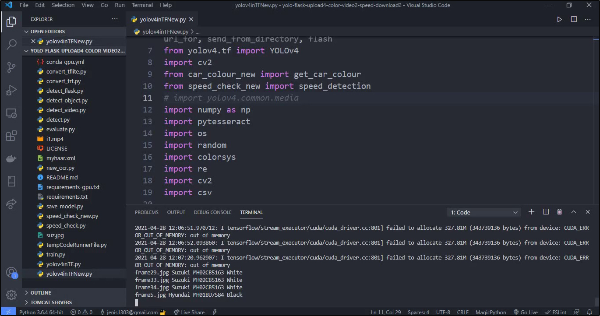
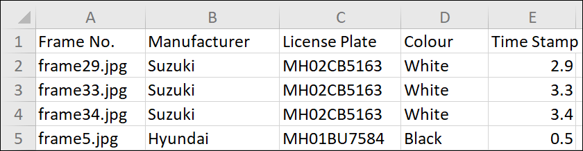
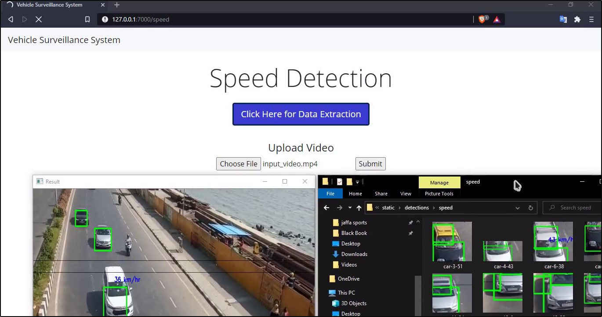
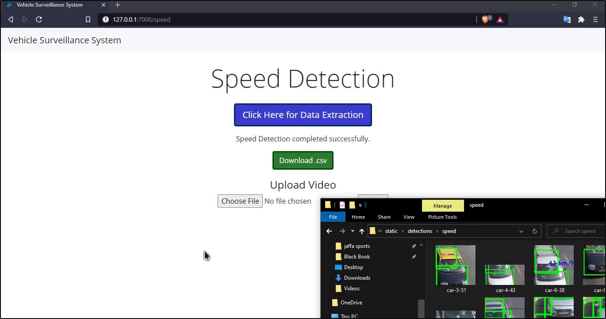
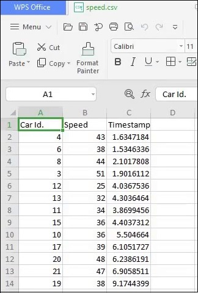

## Video Surveillance System

### Vehicle Identification and Speed Detection (VISD)

### Description:

From a video, VISD extracts vehicle details such the colour, manufacturer, and licence plate number, and then gives this information in the form of a CSV file. Vehicle speed detection is another function of VISD that may be applied to video. When video frames are taken from a video, VISD analyses them to identify vehicles, licence plates, logos, and colours. YOLOv4 is used for vehicle detection, licence plate detection, logo detection, and logo detection. Pixel technique is used for colour detection. Speed detection using the Haarcascade Classifier is a key component of VSID. Through a Web Application made with Flask, all of these VSID functionalities are made available to the user (Screenshots included below).

### How To Run?

<strong>Download the required Weights File:</strong> 

 Pre-Trained YOLOv4 weights : https://drive.google.com/drive/folders/1sbbSLUhji52BAC_vPRJkRb4wuVbVlQBV?usp=share_link

 License Plate YOLOv4 weights : https://drive.google.com/drive/folders/1sbbSLUhji52BAC_vPRJkRb4wuVbVlQBV?usp=share_link

 Vehicle Logo YOLOv4 weights : https://drive.google.com/drive/folders/1sbbSLUhji52BAC_vPRJkRb4wuVbVlQBV?usp=share_link

<strong>Paste all the weights file in /data folder.</strong>

<strong>Download the required python modules:</strong>
<ul>
  <li>cv2</li>
  <li>dlib</li>
  <li>Flask</li>
  <li>matplotlib</li>
  <li>numpy</li>
  <li>Pillow</li>
  <li>pytesseract</li>
  <li>tensorflow</li>
  <li>yolov4 (2.1.0)</li>
</ul>

<strong>Run the main.py file.</strong>
Visit local host on a Web-Browser to access the Web Application.
You can perform Vehicle Data Extraction or Speed Detection by clicking the desired option on the home page.

### Screenshots:

### Publication:

Read more about the project at : https://www.jetir.org/papers/JETIR2105673.pdf

### Credits:

 The AI Guy : https://github.com/theAIGuysCode

